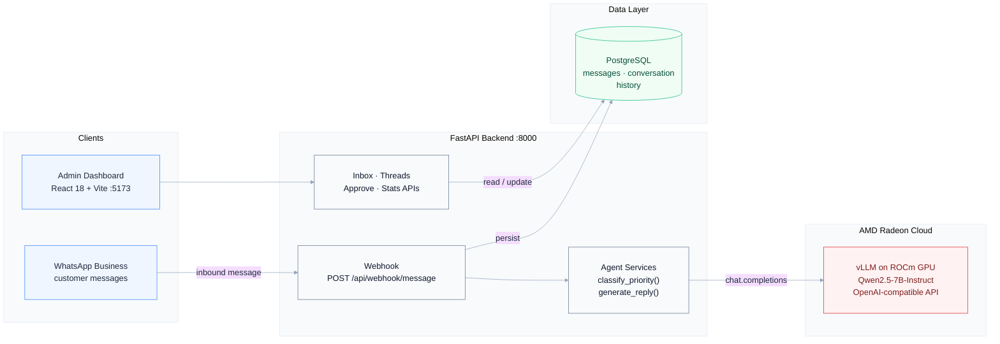
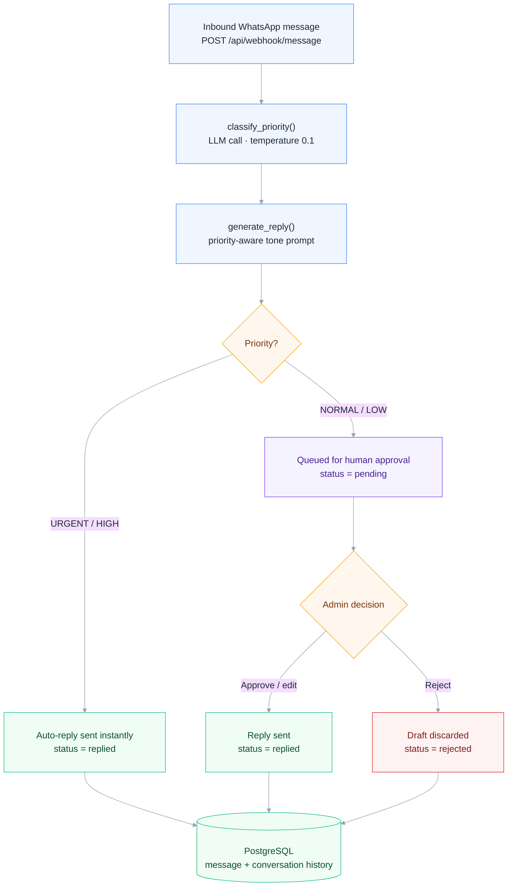

# 🚀 WhatsApp Priority Agent

**Track 2: Development & Local Deployment of Private AI Agents**  
**AMD AI DevMaster Hackathon 2026**

An AI-powered WhatsApp Business agent that automatically classifies incoming messages by priority (**Urgent / High / Normal / Low**) and generates contextual replies using an LLM running on **AMD Radeon Cloud (ROCm)**.

---

# 🎯 What It Does

| Priority | Action | Example |
|----------|--------|---------|
| 🔴 **URGENT** | Auto-reply instantly | "Server down, losing money!" |
| 🟠 **HIGH** | Auto-reply instantly | "Payment gateway broken" |
| 🟢 **NORMAL** | Queue for human approval | "How do I get a new credit card?" |
| ⚪ **LOW** | Queue for human approval | "Love your product!" |

### Result

Critical issues receive AI-generated responses within seconds, while non-urgent conversations remain in the approval queue for human review.

---
# 🎥 Demo Video

> **Video Link** : (https://youtube.com/shorts/BaivNCcSk3M?feature=share)


---

# 🗺️ System Architecture

The system is organized into four tiers. On the client side, inbound WhatsApp traffic enters through the webhook while admins work in the React dashboard. The FastAPI backend hosts both the webhook endpoint and the agent services (priority classification + reply generation), calling a dedicated vLLM instance running **Qwen2.5-7B-Instruct** on an **AMD Radeon GPU (ROCm)** through an OpenAI-compatible API. PostgreSQL persists every message together with its conversation history, which provides the multi-turn memory used for context.



> A static reference diagram is also available at [`docs/architecture.png`](./docs/architecture.png).

---

# 🔄 Message Processing Flow

Every inbound message follows the same pipeline: the webhook triggers a low-temperature LLM call to classify priority, a tone-matched reply is generated, and the message is routed based on its label. **URGENT** and **HIGH** messages are answered instantly by the AI, while **NORMAL** and **LOW** messages are held in the approval queue until an admin approves, edits, or rejects the draft. Every outcome — sent, rejected, or pending — is written to PostgreSQL so the conversation history stays complete.



---

# 🏗️ Tech Stack

### Frontend
- React 18
- Tailwind CSS v4
- Recharts
- Lucide React

### Backend
- Python 3.11
- FastAPI
- SQLAlchemy
- OpenAI SDK

### Database
- PostgreSQL (Local Development)
- AMD Radeon Cloud/Supabase


### AI Inference
- Dedicated vLLM Instance on AMD Radeon Cloud (ROCm)

---

# 🚀 Quick Start

## Prerequisites

Before starting, install:

- Python 3.11+
- Node.js 18+
- PostgreSQL

---

## 1️⃣ Clone the Repository

```bash
git clone https://github.com/YOUR_USERNAME/whatsapp-priority-agent.git
cd whatsapp-priority-agent
```

---

## 2️⃣ Backend Setup

Move into the backend folder.

```bash
cd backend
```

### Create a Virtual Environment

**Linux/macOS**

```bash
python -m venv venv
source venv/bin/activate
```

**Windows**

```powershell
python -m venv venv
venv\Scripts\activate
```

---

### Install Dependencies

```bash
pip install -r requirements.txt
```

---

### Configure Environment Variables

```bash
cp .env.example .env
```

Update `.env` with your AMD Radeon Cloud vLLM credentials.

---

### Create PostgreSQL Database

Start PostgreSQL.

```bash
sudo service postgresql start
```

Create the database.

```bash
createdb whatsapp_agent
```

---

### Run the Backend

```bash
python main.py
```

Backend will start at:

```
http://0.0.0.0:8000
```

---

## 3️⃣ Frontend Setup

Open another terminal.

```bash
cd frontend
```

Install packages.

```bash
npm install
```

Start the development server.

```bash
npm run dev
```

Frontend will run at:

```
http://localhost:5173
```

---

## 4️⃣ Test the Application

Open:

```
http://localhost:5173
```

Then:

1. Simulate an incoming WhatsApp message.
2. Let the AI classify the priority.
3. Observe the generated response.
4. Verify whether the message is auto-replied or queued.

---

# 🔑 AMD Radeon Cloud Setup

See the deployment guide:

```
docs/DEPLOYMENT.md
```

It contains instructions for:

- Launching vLLM instances
- Deploying with Radeon Cloud Notebook
- Using rc-tunnel
- ROCm verification using `rocm-smi`

---

# 📁 Project Structure

```text
whatsapp-priority-agent/
│
├── backend/
│   ├── main.py
│   ├── config.py
│   ├── database.py
│   ├── schemas.py
│   ├── services/
│   │   └── agent.py
│   ├── api/
│   │   └── messages.py
│   ├── requirements.txt
│   └── .env.example
│
├── frontend/
│   ├── src/
│   │   ├── App.jsx
│   │   ├── main.jsx
│   │   ├── index.css
│   │   ├── pages/
│   │   │   ├── LandingPage.jsx
│   │   │   ├── PipelineDemo.jsx
│   │   │   └── Dashboard.jsx
│   │   └── data/
│   │       └── landingData.js
│   ├── index.html
│   ├── package.json
│   └── vite.config.js
│
├── docs/
│   ├── SPEC.md
│   ├── DEPLOYMENT.md
│   └── architecture.png
│
└── README.md
```

---

# 🎨 Landing Page

The app ships with a built-in marketing landing page — a Tailwind CSS rewrite of the original design, fully integrated into the React frontend:

- **`/`** — landing page: hero, live triage simulation, priority rules, system architecture, quickstart terminal, capabilities
- Clicking **Get started** (or **Launch app**) routes you to **`/app`** — the live simulation dashboard
- The dashboard header has an **← About** button to return to the landing page

Routing is handled by `react-router-dom`, so deep links like `/app` survive a page refresh (the FastAPI catch-all serves `index.html` for any path in production).

---

# ✅ Core Capabilities (Track 2 Requirements)

| Requirement | Implementation |
|-------------|----------------|
| ✅ Local Knowledge Retrieval (RAG) | Conversation history stored in PostgreSQL and provided as LLM context |
| ✅ Tool Invocation | `/api/webhook/message` endpoint accepts external triggers |
| ✅ Multi-step Task Planning | Classify → Generate → Store → Auto-reply / Queue |
| ✅ Local Multi-turn Memory | Conversation history maintained for each contact |
| ✅ Permission Control & Privacy | Human approval required for NORMAL and LOW priority messages |

---

# 👤 Team

**Sandeep Kumar**  
*Full Stack Development & AI Integration*

---

## 🏆 AMD AI DevMaster Hackathon 2026

Built for **Track 2 – Development & Local Deployment of Private AI Agents** using **AMD Radeon Cloud**.
